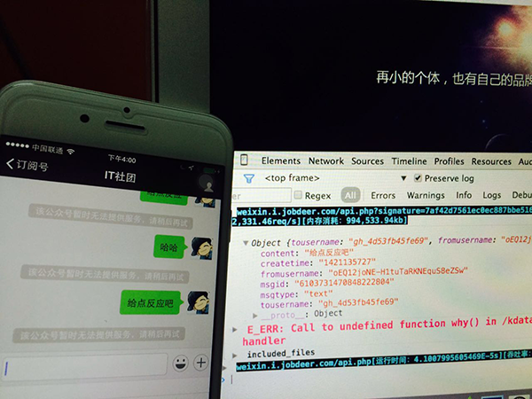
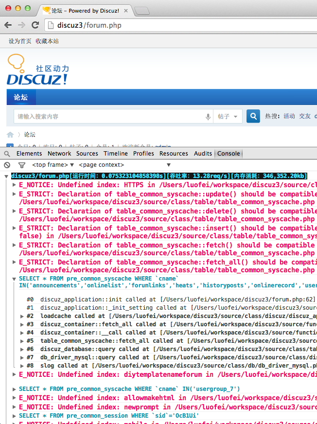
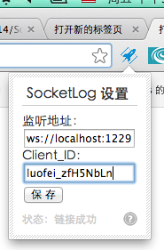
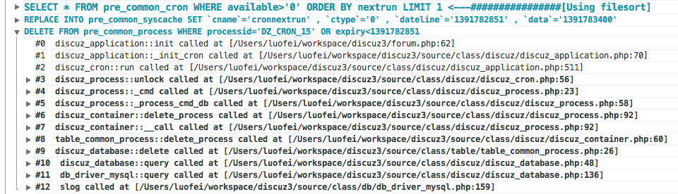
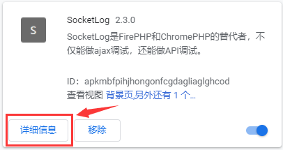
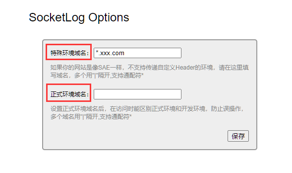
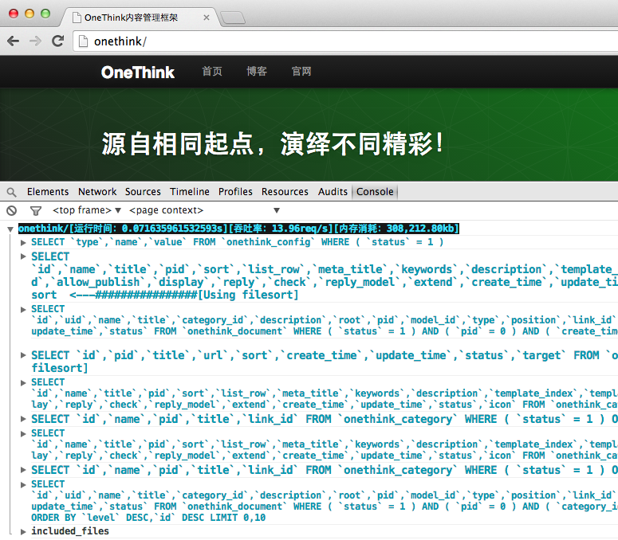

## 一，简介

SocketLog 是一款高效的、探针式的服务器端程序调试和分析工具。

将“探针”引入到目标项目后，SocketLog 会通过在服务端启动的一个 WebSocket 服务，将程序执行过程中收集到的调试信息推送到客户端。
客户端会通过一个 Chrome 插件将调试信息打印到浏览器的 Console 中，这些信息包括程序的运行时间、吞吐率、内存消耗；PHP 的 Error、warning、notice 信息；程序执行的 SQL 语句以及对 SQL 语句的 explain 等等。

SocketLog 使用 PHP 和 NodeJs 开发，是 FirePHP 和 ChromePHP 的替代者，特别适合用于调试 Ajax 方式发起的请求和 API 项目。

### 1、使用场景举例：
**用 SocketLog 来做微信开发调试。**

举一个常见的场景：你在做微信 API 开发的时候，是否遇到了 API 有 bug，微信只提示“该公众账号暂时无法提供服务，请稍候再试” ？

我们根本不知道 API 出了什么问题，由于不能打印信息，只能通过日志来排查，这种方式的调试效率实在是太低了。

现在有了 SocketLog 就不一样了，我们可以知道微信给 API 传递了哪些参数，程序有错误我们也能看见错误信息。



### 2、SocketLog 的用途：
- **API bug 调试**
    - 正在运行的 API 有 bug，不能使用 var_dump() 进行调试，因为会影响 client 的调用。
    将日志写到文件，查看也不方便，特别是带调用栈或大数据结构的文件日志，查看起来十分困难。
    - 是时候让 SocketLog 大显身手了，它通过 WebSocket 将调试日志打印到浏览器的 Console 中，查看起来非常方便。

- **其他用途**
    - 你还可以用它来分析开源程序、分析 SQL 性能、结合 PHP Taint 分析程序漏洞。

### 3、文件和目录简要说明：
```
├── chrome        ：Chrome 插件的源代码目录。
├── chrome.crx    ：Chrome 插件的安装包文件，手动安装方法见下文。
├── demo.php      : Demo 示例文件。
├── Dockerfile
├── composer.json
├── README.md
├── php
│   ├── slog.function.php ：探针文件，在需要发送日志的时候，载入这个文件，然后调用其中的函数 slog() 即可。
│   └── slog.php          ：收集调试日志的函数类库文件，需要在探针文件中载入这个类库。
├── screenshots           ：README.md 本文档中需要的示例图片。
└── server
    ├── bin
    │   └── socketlog-server：当前目录下启动 WebSocket 服务的文件。
    ├── config.json
    ├── index.html          : 申请 client_id 的页面。
    ├── index.js            ：WebSocket 服务的入口文件。
    ├── node_modules        ：Node 所需的组件目录。
    └── package.json
```

### 4、效果展示：
针对一个开源的 Web 项目，我们想基于它做二次开发。如果能在浏览网站的时候，可以从浏览器的 Console 中知道程序都做了些什么，这对二次开发将十分有帮助。

下面的效果图显示，在浏览 discuz 程序时，Console 中打印出了：
- 程序的运行时间、吞吐率和内存消耗信息。
- 程序的 warning，notice 等错误信息。
- 当前页面执行了哪些 SQL 语句，以及执行 SQL 语句的调用栈信息。



## 二，安装与使用
### 1、安装：
- 1，客户端，安装 Chrome 插件。
    - 方法一，在线安装：

        打开 [Chrome 网上应用店](https://chrome.google.com/webstore/category/extensions?hl=zh-CN)，搜索 SocketLog ，然后点击 “添加至 Chrome” 完成安装。如果不能正常访问 Chrome 网上应用店，可以尝试如下的手动安装方法。

    - 方法二，手动安装：

        在 GitHub 上下载 [chrome.crx](https://github.com/luofei614/SocketLog)，打开浏览器地址栏并输入：chrome://extensions，将chrome.crx 拖入打开的页面即可。
- 2，服务端，安装 Socket 服务并启动。
    > （请确保你的环境已经安装了 NodeJs）
    - 方法一，npm 方式安装：
        - 全局安装
            ```shell
            $ npm install -g socketlog-server
            ```
        - 局部安装 (切换到目标项目所在目录)
            ```
            $ npm install socketlog-server
            ```
        - 启动服务
            ```shell
            ## 普通方式运行：
            $ socketlog-server

            ## 如果想让服务在后台运行：
            $ socketlog-server > /dev/null &
            ```
    - 方法二，源码方式安装：
        - 根据实际情况选定目录（例如，在目标项目所在目录下）
            ```shell
            ## 下载项目代码或者 clone
            $ git clone https://github.com/luofei614/SocketLog.git
            ```
        - 启动服务
            ```shell
            ## 请注意实际项目的 index.js 文件的路径
            $ node server/index.js
            ```
- 3，php 探针文件：

    ```php
    <?php
    // 根据实际情况，确定源码的 php 目录放置位置，在需要调试的文件中引入
    include './php/slog.function.php';
    slog('hello world');
    ```
- 4，说明：
    - 这样将会在服务器端起一个 WebSocket 服务，监听端口是 1229。
    - 我们提供公用的服务端，需要去 [申请 client_id](http://slog.thinkphp.cn/) （目前已停服）。
    - 如果你的服务器有防火墙，请开启 1229 和 1116 两个端口，SocketLog 需要使用它们。

### 2、示例：
- 1，在自己的程序中发送日志：
    ```php
    <?php
    include './php/slog.function.php';
    slog('hello world');
    ```
- 2，slog() 函数支持的多种日志类型：
    ```php
    slog('msg', 'log');    // 一般日志
    slog('msg', 'error');  // 错误日志
    slog('msg', 'info');   // 信息日志
    slog('msg', 'warn');   // 警告日志
    slog('msg', 'trace');  // 输出日志，同时会打出调用栈
    slog('msg', 'alert');  // 将日志以alert方式弹出
    slog('msg', 'log', 'color:red;font-size:20px;'); // 自定义日志的样式，第三个参数为 css 样式
    ```

- 3，小结：通过上面例子可以看出，slog() 函数支持三个参数：
    - 第一个参数是 **日志内容**：
        - 日志内容不光能支持字符串哟，大家如果传递数组、对象等作为参数，一样可以打印到 Console 中。
    - 第二个参数是 **日志类型**：
        - 可选，如果没有指定日志类型，则默认类型为 log。
    - 第三个参数是 **自定样式**：
        - 在这里写上你的自定义 css 样式即可。

### 3、配置：
在载入 slog.function.php 文件后，还可以对 SocketLog 进行一些配置。
- 1， SocketLog 配置实例：

    例如，将程序的报错信息也输出到 Console，示例代码如下：

    ```php
    <?php
    include './php/slog.function.php';

    // 输出报错信息
    slog(
        array('error_handler' => true),  // error_handler 需要设置为 true
        'config'
    );
    echo notice; // 制造一个 notice 报错

    // 输出一般日志
    slog('这里是输出的一般日志');
    ```
    - 配置解析：
        - 第一个 slog() 函数有两个参数，第一个参数 **传递配置项的数组**，第二个参数 **设置为 config**。
        - 第二个 slog() 函数，将字符串消息直接输出。

- 2，支持的其他配置项：

    ```php
    <?php
    include './php/slog.function.php';

    slog(
        array(
            'enable'              => true,        // 是否打印日志, [true | false]
            'host'                => 'localhost', // WebSocket 服务器地址，默认为 localhost
            'optimize'            => false,       // 是否显示有利于程序优化的信息，如运行时间、吞吐率、消耗内存等，默认为 false
            'show_included_files' => false,       // 是否显示本次程序运行加载了哪些文件，默认为 false
            'error_handler'       => false,       // 是否接管程序错误，将程序错误显示在 Console 中，默认为 false
            'force_client_id'     => '',          // 日志强制输出到配置的 client_id，默认为空
            'allow_client_ids'    => array()      // 限制允许读取日志的 client_id，默认为空，表示所有人都可以获得日志。
        ),
        'config'
    );
    ```
    - 参数解析：
        - **optimize**
            - 若设置为 true，则日志中显示有利于程序优化的信息。
            - 如：`[运行时间：0.081346035003662s][吞吐率：12.29req/s][内存消耗：346,910.45kb]`
        - **show_included_files**
            - 若设置为 true，则显示出程序运行时加载了哪些文件。
            - 比如，我们在分析开源项目时，如果不知道模板文件在那里，往往需要看一下加载的文件列表。
        - **error_handler**
            - 若设置为 true，则接管报错，将错误信息打印到浏览器 Console。
            - 在开发时 notice 信息能让我们快速发现 bug，但是有些 notice 是不可避免的，如果让他们显示在页面中会影响网页的正常布局，那么设置 error_handler 为 true，可让它显示在浏览器 Console 中，问题成功解决。
    - 另外，此功能结合 [鸟哥](https://www.laruence.com/) 开发的 PHP Taint 也是极佳的。
        - Taint 能自动检测出 XSS、SQL 注入、Shell注入等漏洞。
        - 如果只用 PHP Taint，它的 warning 报错只告诉了变量输出的地方，并不知道变量在哪里赋值、怎么传递？
        - 通过 SocketLog，能看到调用栈，可以轻松地对有问题的变量进行跟踪。更多 Taint 的信息请参考 [这里](https://www.laruence.com/2012/02/14/2544.html)。

- 3，设置 client_id

    在 Chrome 浏览器中，可以设置插件的 client_id，可以是你任意指定的字符串。

    

    **设置了 client_id 后能实现以下功能：**
    - 1，设置 allow_client_ids 配置项，只允许指定的浏览器获取日志，这样就可以把调试代码带上线。
        - 普通用户访问不会触发调试，也不会收到调试日志，而开发人员访问就能看到调试日志，这样有利于找线上 bug。
        - client_id 建议设置为：姓名拼音+随机字符串形式，原因有二。
            - 其一，如果有员工离职可以将其对应的 client_id 从配置项 allow_client_ids 中移除。
            - 其二，加上随机字符串，目的是防备别人根据你公司员工姓名猜测出 client_id，获取线上的调试日志。

        - 设置 allow_client_ids 的示例代码：
            ```php
            slog(
                array(
                    'allow_client_ids' => array('luofei_zfH5NbLn', 'easy_DJq0z80H')    // 可设置多个 cliet_id
                ),
                'set_config'
            );
            ```

    - 2，设置 force_client_id 配置项，让后台脚本也能输出日志到 Console 中。

        - 网站有可能使用了队列，一些业务逻辑通过后台脚本处理，由于后台脚本不和浏览器接触，并不知道当前触发程序的是哪个浏览器。所以如果需要调试，我们就需要强制将日志打印到指定 client_id 的浏览器上。
        - 因此在后台脚本中使用 SocketLog 时，设置 force_client_id 配置项，指定要强制输出浏览器的 client_id 即可（只可设置一个 client_i）。
        - 设置 force_client_id 的示例代码：
            ```php
            <?php
            include './php/slog.function.php';

            slog(
                array(
                    'force_client_id' => 'luofei_zfH5NbLn'    // 只可设置一个 cliet_id
                ),
                'config'
            );
            slog('test');
            ```

### 4，支持 composer（暂不推荐）：

- 1，使用 composer 的安装命令如下：

    > 注意：通过 composer 方式安装的文件版本较旧，有些问题，不能直接使用，故不推荐。
    ```shell
    composer require luofei614/socketlog
    ```
- 2，直接调用静态方法
    ```php
    <?php
    require './vendor/autoload.php';

    use think\org\Slog;

    // 配置 SocketLog
    Slog::config(
        array(
            'enable'              => true,        // 是否打印日志, [true | false]
            'host'                => 'localhost', // WebSocket 服务器地址，默认为 localhost
            'optimize'            => false,       // 是否显示有利于程序优化的信息，如运行时间、吞吐率、消耗内存等，默认为 false
            'show_included_files' => false,       // 是否显示本次程序运行加载了哪些文件，默认为 false
            'error_handler'       => false,       // 是否接管程序错误，将程序错误显示在 Console 中，默认为 false
            'force_client_id'     => '',          // 日志强制输出到配置的 client_id，默认为空
            'allow_client_ids'    => array()      // 限制允许读取日志的 client_id，默认为空，表示所有人都可以获得日志。
        )
    );

    Slog::log('log');      // 一般日志
    Slog::error('msg');    // 错误日志
    Slog::info('msg');     // 信息日志
    Slog::warn('msg');     // 警告日志
    Slog::trace('msg');    // 输出日志，同时会打出调用栈
    Slog::alert('msg');    // 将日志以 alert 方式弹出
    Slog::log('msg', 'log', 'color:red;font-size:20px;');  // 自定义日志的样式，第三个参数为 css 样式
    ```

### 5，支持 ThinkPHP：
ThinkPHP5 之后，在框架层集成了 SocketLog，只需要设置配置即可用。参考：[远程调试](http://www.kancloud.cn/manual/thinkphp5/156120)

### 6，对数据库进行调试：
SocketLog 还能对 SQL 语句进行调试，自动对 SQL 语句进行 explain 分析，打印出有性能问题的 SQL 语句。 如下图所示。



- 图片解析：
    - 图中显示出了三条 SQL 语句，第一条 SQL 语句字体较大，是因为它有性能问题，在 SQL 语句的后台已经标注 Using filesort。
    - 我们还可以点击某个 SQL 语句查看它执行的调用栈，清楚地知道 SQL 语句是如何被执行的，方便我们分析程序、方便做开源程序的二次开发。
    - 图中第三条 SQL 语句为被点开的状态。

- 实际用例：

    - 用 slog() 函数打印 SQL 语句时，第二个参数传递 mysql 或 mysqli 的对象即可。

- 示例代码：
    ```php
    $link = mysql_connect('localhost:3306', 'root', '123456', true);
    mysql_select_db('kuaijianli', $link);

    $sql = "SELECT * FROM `user`";

    slog($sql, $link);
    ```
    后面会以 OneThink 为例再对数据库调试进行演示

    借助上面的方法，SocketLog 还能自动为你检测出没有 where 条件的 SQL 操作，然后自动提示你。

> 注意：有时候在数据比较少的情况下，MySQL 查询不会使用索引，explain 也会提示 Using filesort 等性能问题，其实这时候并不是真正有性能问题，你需要自行判断，或者增加更多的数据再测试。

### 7，对 API 进行调试：
网站调用了 API ，如何将 API 程序的调试信息也打印到浏览器的 Console 中？

- 方法一：配置 force_client_id
    - 前面我们讲了一个 force_client_id 配置，能将日志强制记录到指定的浏览器。这种方法同样适用于将 API 的调试信息打印到 Console 中。
    - 缺点： force_client_id 只能指定一个 client_id，如果我们的开发环境是多人共用，这种方式就不方便了。

- 方法二：识别 User-Agent
    - 其实只要将浏览器发送的 User-Agent 再传递给 API，API 程序中不用配置 force_client_id，也能识别当前访问程序的浏览器，将日志回传回来。
    - 我们需要将 SDK 代码稍微做一下修改。调用 API 的 SDK，一般是用 curl 写的，添加下面的代码可以将浏览器的 User-Agent 传递到 API 。
        ```php
        $headers = array();
        if (isset($_SERVER['HTTP_USER_AGENT'])) {
            $headers[] = 'User-Agent: ' . $_SERVER['HTTP_USER_AGENT'];
        }

        if (isset($_SERVER['HTTP_SOCKETLOG'])) {
            $headers[] = 'Socketlog: ' . $_SERVER['HTTP_SOCKETLOG'];
        }

        curl_setopt($ch, CURLOPT_HTTPHEADER, $headers);
        ```

### 8，区分正式和开发环境：
- 1，进入 Chrome 浏览器的 “更多工具” ----> “扩展程序(E)” 或者直接在地址栏输入 `chrome://extensions/`，打开扩展程序列表页。

- 2，找到 “SocketLog” 然后点击 “详细信息”，打开 SocketLog 的详细页。



- 3，找到“扩展程序选项”，点击右侧的按钮。


- 4，此时在打开的 SocketLog Options 页，可以设置 “特殊环境域名” 和 “正式环境域名”。



### 9，分析开源程序：

有了 SocketLog，我们能很方便的分析开源程序，下面以 OneThink 为例，大家可以在 http://www.topthink.com/topic/2228.html 下载最新的 OneThink 程序。 安装好 OneThink 后，按下面步骤增加 SocketLog 程序。

- 1，将 slog.php 复制到 OneThink 的程序目录中，如果没有想好将文件放到哪个子文件夹，可以暂且放到根目录。
- 2，编辑入口文件 index.php，在代码的最前面加载 slog.function.php，并设置 SocketLog。
    ```php
    <?php
    include './slog.function.php';
    slog(
        array(
            'error_handler'       => true,
            'optimize'            => true,
            'show_included_files' => true
        ),
        'config'
    );
    ```

- 3，编辑 ThinkPHP/Library/Think/Db/Driver.class.php 文件，在这个类中的 execute() 方法为一个执行 SQL 语句的方法，增加代码：
    ```php
    slog($this->queryStr, $this->_linkID);
    ```
- 4，类中的 query() 方法也是一个执行 SQL 语句的地方，同样需要增加上面的代码。

- 5，然后浏览网站看看效果：



通过 Console 的日志，访问每一页我们都知道程序干了些什么，这是一件很爽的事情。

> 提示：
另一种更简单的方法，因为 OneThink 每次执行完 SQL 语句都会调用 `$this->debug`， 所以我们可以把 `slog($this->queryStr, $this->_linkID);` 直接写在 `Db.class.php` 文件的 debug() 方法中。 这样不管是 mysqli 还是 mysql 驱动都有效。

## 三，视频教程
[http://edu.normalcoder.com/course/941](http://edu.normalcoder.com/course/941)

感谢猿团的张盛翔（诺墨）提供教程。

## 四，About Me
* Author: @luofei614 新浪微博：http://weibo.com/luofei614
* 优伯立信创始人，ThinkPHP核心开发者之一，待过新浪云计算

[1]: https://github.com/luofei614/SocketLog/raw/master/screenshots/discuz.png
[2]: https://github.com/luofei614/SocketLog/raw/master/screenshots/socketlog.png
[3]: https://github.com/luofei614/SocketLog/raw/master/screenshots/sql.png
[4]: https://github.com/luofei614/SocketLog/raw/master/screenshots/onethink.png
